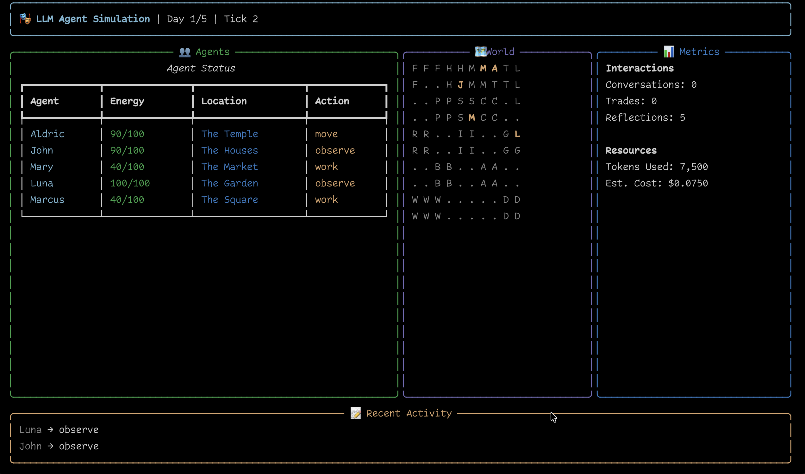

# LLM Agent Simulation Framework

A sophisticated multi-agent simulation where AI agents develop distinct personalities through interactions, form memories using a temporal knowledge graph, and evolve their behaviors over time.


*Live dashboard showing agent activities, world map, and real-time metrics*

## 🌟 Features

### Core Features
- **Personality Evolution**: Agents develop unique personalities based on Big Five traits
- **Temporal Memory**: Neo4j + Graphiti for bi-temporal knowledge graphs with full episode tracking
- **Smart Conversations**: Strands A2A protocol for autonomous agent interactions  
- **Special Sage Agent**: One agent with limited web search capabilities (1x/day)
- **Token Management**: Built-in rate limiting to control LLM costs with dynamic model selection
- **Rich Monitoring**: Grafana dashboards for real-time simulation metrics
- **Live Dashboard**: Real-time CLI visualization of agent activities

### Performance & Optimization
- **Graphiti Optimizations**: Batch processing, caching, and timeout handling for 5-10x faster memory operations
- **JSON Truncation**: Safe episode storage with automatic truncation to prevent parsing errors
- **Parallel Processing**: Concurrent perception and decision phases for faster simulation
- **Memory Context**: Graph-based context retrieval for informed agent decisions
- **Request Timeouts**: Automatic timeout handling (30s default) for resilient operation

### Simulation Management
- **Checkpoint System**: Save and resume simulations with full state preservation
- **Continue Command**: Resume from checkpoints with `--continue` parameter
- **Data Isolation**: Each simulation run uses unique group_id for memory partitioning
- **Graceful Interruption**: CTRL+C handling with state preservation
- **Auto-save**: Automatic checkpoints at end of each simulated day

## 🏗️ Architecture

See [docs/ARCHITECTURE.md](ARCHITECTURE.md) for detailed system design.

### Key Components
- **Agents**: Autonomous entities with personalities, memories, and tools
- **World Grid**: 10x10 spatial environment with locations and resources
- **Memory System**: Neo4j graph database with temporal awareness
- **Orchestration**: Event-driven simulation with conversation management
- **Monitoring**: Prometheus + Grafana for metrics and visualization

## 🚀 Quick Start with Docker Compose

### Prerequisites
- Docker and Docker Compose
- Python 3.10+
- Make (for convenience commands)

### Setup

1. **Clone the repository**
```bash
git clone <repository>
cd sim
```

2. **Configure environment**
```bash
cp .env.example .env
# Edit .env with your OpenAI API key
```

3. **Start services with Docker Compose**

**Option A: Using Makefile (Recommended)**
```bash
# Initial setup (creates directories, copies env)
make setup

# Start all services
make up

# Check service health
make status
```

**Option B: Using Docker Compose directly**
```bash
# Create necessary directories
mkdir -p monitoring/prometheus monitoring/grafana/provisioning/datasources
mkdir -p notebooks data logs neo4j/conf

# Start all services
docker compose up -d

# View logs
docker compose logs -f

# Stop services
docker compose down
```

This starts:
- **Neo4j** (http://localhost:7474) - Graph database for agent memories
- **Grafana** (http://localhost:3000) - Metrics dashboard (admin/admin)
- **Prometheus** (http://localhost:9090) - Metrics collection
- **Redis** (localhost:6379) - Caching and session management
- **Jupyter** (http://localhost:8888) - Analysis notebooks (token: simulation123)
- **Neo4j Exporter** - Prometheus metrics from Neo4j
- **Node Exporter** - System metrics

4. **Install Python dependencies**
```bash
# Create and activate virtual environment (required on macOS/Linux)
python3 -m venv venv
source venv/bin/activate  # On Windows: venv\Scripts\activate

# Install the simulation package
pip install -e .
```

5. **Run the simulation**
```bash
# With virtual environment activated and services running
python -m src.main run --agents 5 --days 3

# Or use the sim command if installed
sim run --agents 5 --days 3
```

## 🛠️ Alternative Setup (Without Docker)

If you prefer to run services locally:

### Step 1: Install Dependencies

```bash
# Create virtual environment
python3 -m venv venv
source venv/bin/activate  # On Windows: venv\Scripts\activate

# Install dependencies
pip install -r requirements.txt
```

### Step 2: Neo4j Setup

#### Option A: Docker (Just Neo4j)

```bash
# Start Neo4j with Docker
docker run --name neo4j-sim \
  --restart unless-stopped \
  -p 7474:7474 -p 7687:7687 \
  -e NEO4J_AUTH=neo4j/simulation123 \
  -e NEO4J_PLUGINS='["apoc", "graph-data-science"]' \
  -v "$PWD/neo4j-data":/data \
  -d neo4j:5.26-community

# Wait for Neo4j to start (about 30 seconds)
sleep 30

# Verify it's running
docker logs neo4j-sim

# Neo4j Browser will be available at: http://localhost:7474
# Default credentials: neo4j / simulation123
```

#### Option B: Native Installation

**macOS (Homebrew):**
```bash
brew install neo4j
neo4j start
# Open http://localhost:7474
# Default: neo4j/neo4j (will prompt to change)
```

**Windows/Linux:**
Follow the [official installation guide](https://neo4j.com/docs/operations-manual/current/installation/)


### Step 3: Run Simulation

```bash
# Basic run
python -m src.main run --agents 5 --days 10

# With debug output
python -m src.main run --agents 5 --days 3 --debug

# With detailed trace logging
python -m src.main run --agents 5 --days 3 --trace

# Without Graphiti (uses basic memory)
python -m src.main run --agents 5 --days 3 --no-graphiti

# Continue from checkpoint
python -m src.main run --continue checkpoints/checkpoint_day_2.pkl --days 3

# View checkpoint details
python -m src.main view --latest

# Clear Neo4j database
python -m src.main clear --confirm

# View help
python -m src.main --help
```

## 📚 CLI Commands

The simulation provides a rich CLI interface with multiple commands:

### `sim run` - Run the simulation
```bash
# Basic usage
sim run --agents 5 --days 10

# Options:
#   --agents, -a    Number of agents to simulate (default: 5)
#   --days, -d      Number of days to simulate (default: 10)
#   --config, -c    Configuration file path
#   --debug         Enable debug mode with verbose logging
#   --trace         Enable detailed per-tick step/action logs
#   --no-graphiti   Use basic memory instead of Graphiti
#   --continue      Continue from checkpoint file

# Examples:
sim run --agents 3 --days 5 --debug
sim run --continue checkpoints/checkpoint_day_2.pkl --days 3
```

### `sim view` - View checkpoint details
```bash
# View latest checkpoint
sim view --latest

# View specific checkpoint
sim view --checkpoint checkpoints/checkpoint_day_3.pkl

# Shows:
# - Simulation day and tick
# - Agent states and locations
# - Metrics (conversations, trades, reflections)
# - Token usage and costs
```

### `sim clear` - Clear Neo4j database
```bash
# Clear all data (requires confirmation)
sim clear --confirm

# Clear without confirmation prompt
sim clear --force
```

### Checkpoint System

Checkpoints are automatically saved at the end of each simulated day. They contain:
- Complete agent states (location, goals, relationships, inventory, health, energy)
- Simulation metrics and statistics
- Event log (last 100 events)
- Token usage data

To continue a simulation:
```bash
# Continue from latest checkpoint
sim run --continue checkpoints/checkpoint_day_5.pkl --days 2

# This will:
# 1. Load the saved state from day 5
# 2. Restore all agent states and metrics
# 3. Continue simulation for 2 more days (days 6-7)
```

## 📝 Configuration

Edit `.env` file for customization:

```env
# LLM Configuration
OPENAI_API_KEY=your-api-key
OPENAI_MODEL_ID=gpt-5        # Primary model for agents
OPENAI_SAGE_MODEL_ID=gpt-5   # Model for sage agent

# Simulation Parameters
MAX_AGENTS=5
MAX_DAYS=10
TICKS_PER_DAY=24

# Rate Limiting
DAILY_TOKEN_BUDGET=1000000    # 1M tokens/day (~$5 with GPT-5)
PER_AGENT_TOKEN_LIMIT=200000  # 200k tokens per agent

# Neo4j (automatically configured by docker-compose)
NEO4J_URI=bolt://localhost:7687
NEO4J_USERNAME=neo4j
NEO4J_PASSWORD=simulation123
```

### Token Budget & Model Selection

The simulation uses intelligent model selection based on action priority and remaining budget:

- **Daily Budget**: 1,000,000 tokens (~$5/day with GPT-5)
- **Per-Agent Limit**: 200,000 tokens (prevents single agent from consuming all tokens)
- **Model Costs**:
  - GPT-5: $0.005 per 1k tokens (primary model for rich interactions)
  - GPT-4o: $0.0025 per 1k tokens (fallback when budget < 30%)
  - GPT-4o-mini: $0.00015 per 1k tokens (emergency fallback)

**Dynamic Model Selection**:
- High-priority actions (reflect, web_search): GPT-5 if budget > 20%, else GPT-4o
- Medium-priority actions (speak, trade): GPT-5 if budget > 60%, GPT-4o if > 30%
- Low-priority actions (move, observe): GPT-5 if budget > 80%, else GPT-4o/mini
- The system automatically downgrades models as daily budget depletes

## 🛠️ Useful Commands

### Using Makefile
```bash
# Service management
make setup       # Initial setup (directories, env file)
make up          # Start all services
make down        # Stop all services
make restart     # Restart services
make status      # Check service status and port availability
make logs        # View all logs (follow mode)

# Database operations
make neo4j       # View Neo4j logs
make neo4j-shell # Access Neo4j cypher shell
make neo4j-backup # Backup Neo4j database

# Redis operations  
make redis       # View Redis logs
make redis-cli   # Access Redis CLI

# Monitoring
make monitoring  # Open Grafana dashboard in browser

# Development
make dev-setup   # Setup and start everything
make dev-reset   # Clean reset of environment

# Cleanup
make clean       # Remove all data and volumes (careful!)
```

### Using Docker Compose Directly
```bash
# Start services
docker compose up -d

# Stop services
docker compose down

# View logs
docker compose logs -f [service-name]

# Execute commands in containers
docker exec -it sim-neo4j cypher-shell -u neo4j -p simulation123
docker exec -it sim-redis redis-cli

# Remove everything including volumes
docker compose down -v
```

## Understanding the Simulation

### Agent Roles
- **Sage (Aldric)**: Keeper of knowledge with web search ability (1x/day)
- **Farmer (John)**: Works the fields, trades produce
- **Merchant (Mary)**: Trades goods, accumulates wealth
- **Artist (Luna)**: Creates art, expresses emotions
- **Guard (Marcus)**: Maintains order, patrols village

### World Locations
- **Library (L)**: Sage's home, knowledge hub
- **Market (M)**: Trading center
- **Temple (T)**: Spiritual center
- **Houses (H)**: Agent homes
- **Forest (F)**: Resource gathering
- **Square (S)**: Social gathering point

### Memory System
Agents use Graphiti's temporal knowledge graph to:
- Store conversations with timestamps
- Track relationships (trust, friendship)
- Remember facts and rumors
- Reflect on experiences
- Propagate knowledge through conversation

## Monitoring & Costs

### Token Usage
- Daily budget: 1,000,000 tokens (configurable)
- Per-agent limit: 200,000 tokens/day
- Estimated cost: ~$5 per simulated day with GPT-5

### Grafana Dashboard
Access at http://localhost:3000 (admin/admin)
- Agent activity metrics
- Memory formation rates
- Token usage tracking
- Conversation statistics

### Neo4j Browser
Access at http://localhost:7474
- Visualize agent memory graphs
- Query temporal relationships
- Explore knowledge networks

## Troubleshooting

### Neo4j Connection Issues
```bash
# Check if Neo4j is running
make status

# Restart Neo4j
make restart

# Check logs
make neo4j
```

### OpenAI API Issues
- Verify API key is correct in `.env`
- Check API key has sufficient credits
- Ensure not hitting rate limits
- Use GPT-4 instead of GPT-5 if model not available

### Memory Issues
- Neo4j requires ~2GB RAM minimum
- Reduce `MAX_AGENTS` if running out of memory
- Use `make clean` to clear old data (careful!)

## 🧑‍🔬 Agent Types

### Regular Agents
- Develop personalities through interactions
- Form memories and relationships
- Make decisions based on personality traits
- Engage in autonomous conversations

### Sage Agent
- Special knowledge-keeper role
- Limited web search ability (1x/day)
- Higher initial knowledge level
- Shares wisdom with other agents
- Creates knowledge artifacts (scrolls)

## 🔧 Extending the Framework

### Adding New Agent Types
Create a new class extending `SimulationAgent` in `src/agents/`:
```python
from src.agents.base_agent import SimulationAgent

class MerchantAgent(SimulationAgent):
    def __init__(self, ...):
        super().__init__(...)
        # Add custom initialization
```

### Adding New Tools
Use the Strands `@tool` decorator:
```python
@tool
async def custom_action(self, parameter: str) -> str:
    """Tool description"""
    # Implementation
    return result
```

### Adding New Locations
Edit `src/world/grid.py` to add location types and their properties.

## 📁 Project Structure

```
sim/
├── src/                    # Source code
│   ├── agents/            # Agent implementations
│   ├── memory/            # Memory management
│   ├── world/             # World grid system
│   ├── orchestration/     # Simulation engine
│   └── config/            # Configuration
├── monitoring/            # Grafana dashboards
├── docker-compose.yml     # Service definitions
├── Makefile              # Convenience commands
└── .env                  # Configuration (create from .env.example)
```

## 🤝 Contributing

1. Fork the repository
2. Create a feature branch
3. Make your changes
4. Test with `make status` and run simulation
5. Submit a pull request

## 📄 License

MIT License - See LICENSE file for details

## 🙏 Acknowledgments

- Built with [Strands Agents SDK](https://github.com/strands-ai/strands)
- Memory system inspired by Graphiti
- Simulation concepts from Stanford's Smallville paper
